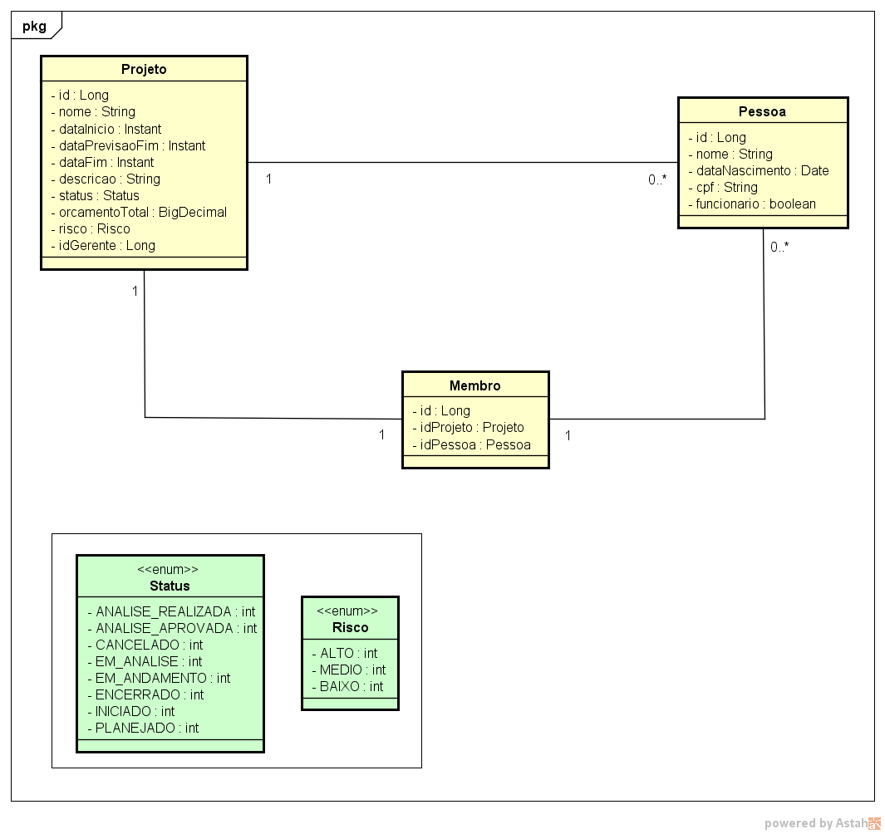

# Projeto Cadastro de sistemas

---

---

## O que este repositório contém

1. CRUD de Projetos com algumas especificidades requeridas
2. Alguns testes unitários com JUNIT5
4. Swagger API REST.

---

## Qual o objetivo deste repositório

1. Processo seletivo para a empresa anônima
2. Criar um cadastro de "sistemas"
3. Documentar o projeto com o Swagger.

---

## O que é necessário para startar o projeto

1. Java na versão 12
2. Banco de dados Postgresql (foi usado a versão 12)

---

## Modelo do diagrama usado



---

## Endpoits de consultas de sistemas cadastrados


### Cadastrar Projetos.
```

http://localhost:8080/projetos/cadastrar

```

### Buscar Projetos por id. Deve ser passado o parâmetro id com o id do projeto a ser buscado
```

http://localhost:8080/projetos/buscar/{id}

```

### Atualizar Projetos. Deve ser passado o parâmetro id com o id do projeto a ser alterado
```

http://localhost:8080/projetos/atualizar/{id}

```

### Excluir Projetos. Deve ser passado o parâmetro id com o id do projeto a ser deletado
```

http://localhost:8080/projetos/deletar/{id}

```

---

### Json para cadastro de projeto
```json
{
  "nome": "Projeto de PIX 2.0",
  "dataInicio": "2023-09-11T00:00:00",
  "dataPrevisaoFim": "2023-09-11T00:00:00",
  "dataFim": "2050-09-11T00:00:00",
  "descricao": "Este é um projeto para movimentações financeiras no Brasil",
  "orcamento": 1000000.00,
  "risco": 1,
  "gerente": {
    "id" : 3
  }
}
```


